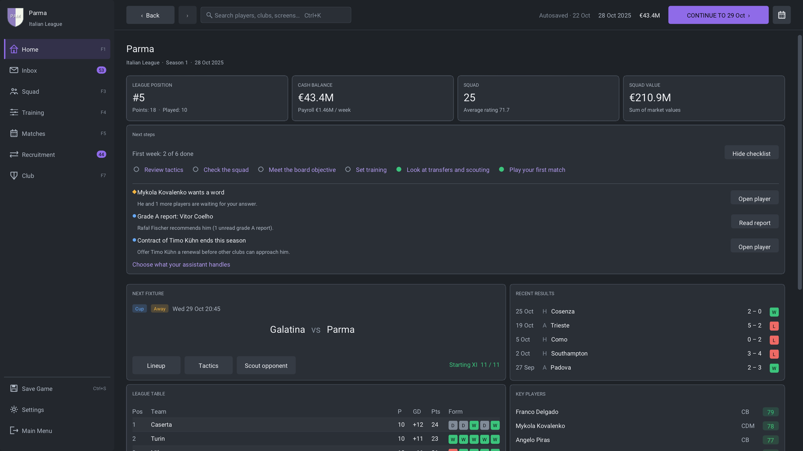

# Player12

**Build a club. Shape its football. Take your career around the world.**

[](docs/development/builds.md)
[](https://github.com/FlavioMili/FootballManagement/actions/workflows/ci.yml)
[](LICENSE)

Player12 is a completely open-source football management game,
licensed under the GNU GPL v3. Manage a club in your world of football!
Build your squad, develop young players, negotiate transfers,
balance the books and earn your next job. Watch your tactics unfold in **2D
or 3D**, or take control of your team on the pitch with a keyboard or gamepad.

Built in C++23 with SDL3, Dear ImGui and SQLite for Linux and macOS, with an
experimental Windows build. Version 1.0 is being prepared for release. See the [changelog](CHANGELOG.md)
for release details and known limitations.



## Your club, your football

- **A living football world.** Promotion and relegation, domestic cups,
  continental competition and international football across eleven countries.
- **Matches you can watch or play.** Player movement, ball physics, fatigue,
  pressing, tackles, goalkeeping and football rules run in a shared simulation.
  Choose a tactical view, a broadcast camera, highlights or a quick result.
- **Tactics with visible consequences.** Set formations, roles and duties,
  shape your team with the ball, make substitutions and give touchline shouts.
- **Build for the next season.** Scout uncertain talent, negotiate contracts
  and transfers, plan training and bring players through the academy.
- **A career beyond the touchline.** Manage finances, board expectations,
  supporters and the dressing room. Move between clubs or lead a national team.
- **Make yourself at home.** English and Italian, six themes, accessibility
  options, configurable controls, save slots and recoverable backups.

| Match day | Squad building |
|----------|----------------|
|  |  |
| Watch from the broadcast camera or control a player. | Get to know the players who will carry your season. |
|  |  |
| Read the shape and movement of both teams. | Give your team a shape and each position a job. |

Explore the [full feature tour and more screenshots](docs/project/features.md)
or the [roadmap](docs/project/roadmap.md).

## Quickstart

On Linux, install the [build prerequisites](docs/user/installation.md#linux)
first: Git, CMake 3.29+, Ninja, a C++23 compiler and SDL's system dependencies.
The first configure downloads the project's dependencies.

```sh
git clone https://github.com/FlavioMili/FootballManagement.git
cd FootballManagement
cmake --preset release
cmake --build --preset release --parallel 4
./out/build/release/src/Player12
```

For Ubuntu with GCC 14, use
`CC=gcc-14 CXX=g++-14 cmake --preset release` for the configure step.
Follow the dedicated [macOS](docs/user/installation.md#macos) or
[Windows](docs/user/installation.md#windows-experimental) setup instructions
on those platforms.

Choose **New Game**, create your manager and pick a club—or start unemployed.
The [first-career guide](docs/user/getting-started.md) walks you through your
squad, tactics and first match.

## Find your next step

| I want to… | Start here |
|------------|------------|
| Play the game | [First career](docs/user/getting-started.md) · [Controls](docs/user/controls.md) |
| Install, run or find my saves | [Platform setup](docs/user/installation.md) · [Files and troubleshooting](docs/user/files-and-troubleshooting.md) |
| Make my first contribution | [Contributor guide](CONTRIBUTING.md) |
| Understand the implementation | [Developer guide](docs/development/README.md) · [Architecture](docs/ARCHITECTURE.md) |
| Work on matches or player AI | [Match engine](docs/development/match-engine.md) · [Player behavior](docs/development/player-behavior.md) |
| Change game data or extend behavior | [Modding guide](docs/development/extending-and-modding.md) · [Data format](assets/user_made_data/README.md) |
| Run tests or balance experiments | [Tests and tools](docs/development/testing.md) |

## Help build the game

Code, documentation, translations, game data, bug reports and playtesting are
all welcome. The [contributor guide](CONTRIBUTING.md) helps you choose a small
first change and send a pull request.

Add your name to [CONTRIBUTORS.md](CONTRIBUTORS.md). You can also add yourself
as a player at your favorite club in `assets/user_made_data/players/`:
the [player cameo guide](docs/contributing/player-cameo.md) has a complete
example. Both forms of credit are optional.

## Open source

The game's source code is fully open under the
[GNU General Public License v3](LICENSE). Bundled libraries and other assets
retain their own licences; see the [release documentation](docs/development/release.md).
