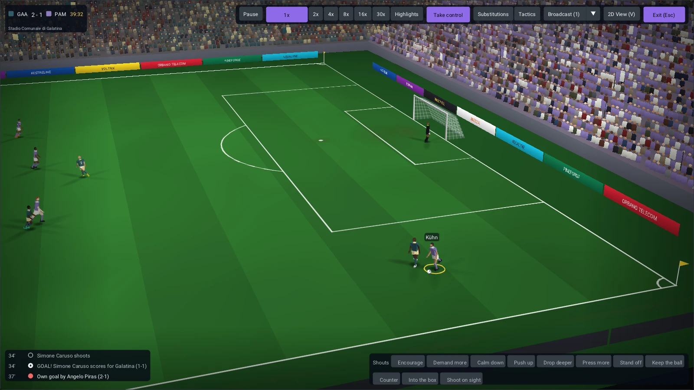

# Player12 website

The static showcase and rendered documentation for
[Player12](https://github.com/FlavioMili/FootballManagement), an open-source
football management game licensed under GNU GPL v3.



## Preview locally

```sh
python3 -m http.server 8765 --bind 127.0.0.1
```

Open `http://localhost:8765/`. The site uses local images, video, CSS and
JavaScript, with a light default, the game's green accent and an optional
slate dark theme. It does not need a JavaScript framework or a CDN at runtime.

## Update documentation

The maintained guides live on the source branch. From that checkout:

```sh
python3 -m pip install -r scripts/requirements-docs.txt
python3 scripts/build_website_docs.py --site /path/to/website-checkout
```

The generator updates the searchable docs index and guides while preserving
this branch's showcase and media. Source-code links point back to the existing
GitHub repository. See the [website guide](docs/development/website.html).

## Validate

```sh
python3 scripts/check_site.py
git diff --check
```

The branch's CI checks local links, anchors, image descriptions and the media
budget. Browser checks should also cover navigation, gallery filters, video
playback, moon/sun icons, reduced motion and narrow screens in both themes.

## Game media

The images and two silent 15-second clips were captured through the game's
real GUI and match renderer. They are compressed as WebP and browser-compatible
H.264/VP9 video. Raw capture frames and development tools stay outside this
checkout. Capture instructions and provenance are in [media/game/README.md](media/game/README.md).
