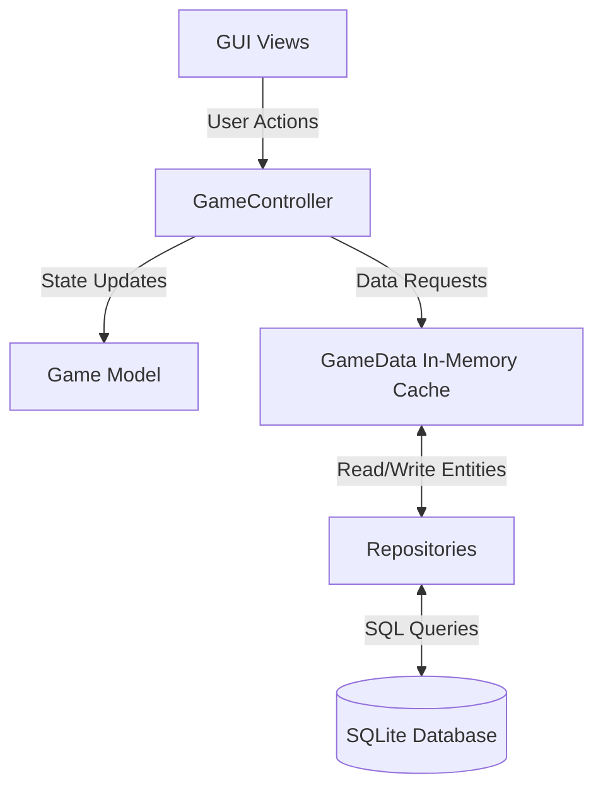

# Architectural Overview

This document outlines the core architecture of the Football Management Project. The system is designed with a clear separation of concerns, heavily utilizing the Model-View-Controller (MVC) paradigm alongside a Repository pattern for data persistence.

## High-Level Data Flow

## Core Components

### 1. The Game Model (`Game`)
The `Game` class holds the overarching state machine for the simulation. It dictates the current phase of the game (e.g., Main Menu, Team Selection, Playing) and orchestrates the transition between UI scenes.

### 2. The Game Data Cache (`GameData`)
`GameData` serves as the centralized, in-memory repository of all game entities (Teams, Players, Leagues, Fixtures). Because reading from the database is expensive, `GameData` loads everything on game start and flushes changes to the database periodically or upon user request.

### 3. Repositories
We use the Repository pattern to isolate SQL queries from the rest of the application logic. Each repository (e.g., `PlayerRepository`, `FixtureRepository`) is responsible for inserting, updating, and querying a specific domain entity. They use the `DatabaseConnection` class to execute prepared statements safely.

### 4. Database Connection (`DatabaseConnection`)
This class wraps raw `sqlite3` pointers and handles the RAII lifecycle of the database connection. It provides transaction boundaries (`beginTransaction()`, `commitTransaction()`, `rollbackTransaction()`) to ensure data consistency during bulk operations.

### 5. GUI Views (`GUIView` and Scenes)
The presentation layer is built on Dear ImGui. The `GUIView` class manages the main render loop, pushing and popping `IScene` objects onto a scene stack to handle navigation (e.g., moving from the Main Menu to the Roster Scene).
