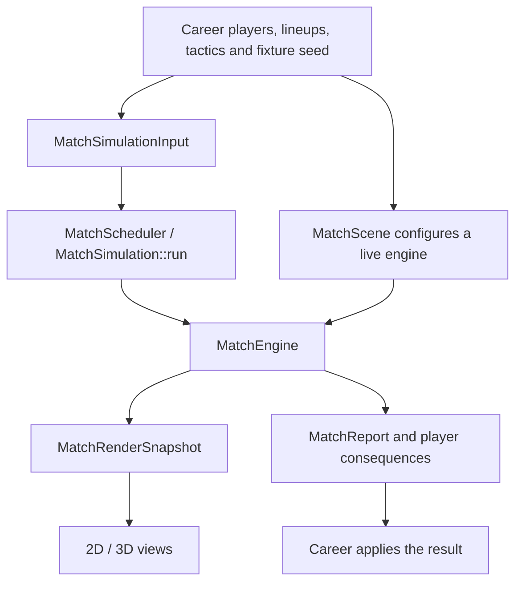

# Match engine: implementation and rationale

The match engine is the part of the game engine that turns lineups, tactics,
player attributes and a seed into a match. The wider career engine advances
days and applies its results; see [Architecture](../ARCHITECTURE.md).
For individual decisions, read [Player behavior](player-behavior.md).

## Ownership and data flow



[MatchEngine](../../src/model/match_engine.h) owns match slots, the ball, copied
strategies, random-generator state, events and statistics. It borrows
`const Player*` values from the lineups and a `const StatsConfig&`. Keep those
objects alive and unchanged until the engine and any look-ahead copies are
destroyed. A copied engine has independent simulation state but shares those
read-only inputs. It is not a deep copy of a career.

`MatchPlayer` is a pitch slot, not the persistent `Player`. Substitution reuses
the slot and gives the incoming player a new `PlayerMatchStats` entry; the
outgoing player's statistics remain available. Never identify a player's
career by a vector index. Use `PlayerID`, and use `statsIndex` for the current
occupant's match statistics.

The engine does not update the database or persistent player condition during
play. `MatchdaySquad::carryCondition()` supplies starting condition;
`MatchdaySquad::consequences()` extracts the outcome. Reports and consequences
are applied by the career after simulation. This separation lets background
matches read players concurrently without racing with career mutations.

## Coordinates and clocks

| Quantity | Convention |
|----------|------------|
| Player/ball x, y | Normalized pitch coordinates; x × 105 and y × 68 give metres |
| Attack direction | Home toward x = 1; away toward x = 0 throughout the match |
| Lineup coordinates | Own goal at x = 0 for both teams; away x is mirrored when loaded |
| Velocity / acceleration | Metres per simulated second / metres per second squared |
| Ball z | Historical renderer unit: multiply by `Units::BALL_Z_METRES` (105) for metres |
| RoleProfile distances | Metres; convert with the appropriate pitch dimension |
| Facing angle | Radians in normalized pitch space, not a metric velocity heading |
| `stepCounter` | Integer ticks of `Timing::FIXED_STEP_SECONDS` (0.1 s) |
| Match clock | Minutes displayed for the current period, plus announced added time |

Use `toMetres`, `toPitch`, `distance` and `metricDirection` in
[match_engine.cpp](../../src/model/match_engine.cpp) for geometry. Computing
Euclidean distances directly on normalized coordinates makes the rectangular
pitch behave like a square.

There are three different notions of time:

* **Wall time** is supplied by the frame loop. Playback speed controls how much
  simulated time the viewer requests.
* **Simulated time** advances bodies, ball flight, cooldowns and input. Full
  fidelity uses a 0.1 s step; the free ball uses four 0.025 s substeps, and a
  controlled player's body uses five 0.02 s substeps. Tactical targets normally
  refresh every two ticks and also on possession/flight changes.
* **Match-clock time** usually follows simulated time, excluding breaks.
  In Play, `setPlayHalfMinutes()` scales the clock by `45 / minutes` while
  physical motion stays at the same speed. Load uses physical time; appearances
  and ball-in-play minutes follow the match clock. The engine accepts 3–15
  minutes per half, with 0 for the watch clock.

This split makes short played halves possible without making players or shots
move nine times faster. It is documented in the recovered
[gameplay design notes](design-notes.md).

## One authoritative simulation step

`simulateStep()` calls `simulateStepBody()` and then describes pending events.
The body executes this sequence:

1. Apply due manager commands at the current tick boundary, capture the previous
   interpolation frame, advance `stepCounter`, then apply due controller input.
2. Validate the controlled player, age action/touch/dive timers and shouts,
   recover temporary formation familiarity and refresh effective team sliders.
3. Update team phases and dispatch on `MatchState`.
4. In `PLAYING`, update player targets and movement, advance the clock and load,
   resolve dribbling/challenges/actions, track pressure, then integrate the free
   ball if play still continues. Account for possession, advantage and injuries.
5. Refresh ratings when due and check period completion on the ordinary path.

Goal celebrations, shootouts and half-time return from their own branches.
Other restarts run substitution checks, reposition players, advance the clock
when appropriate and call `completeRestart()` when ready. A goal celebration
keeps the clock running; half-time and the shootout do not.

Order is part of behavior. Moving actions before players changes tackle reach;
moving commands across the tick increment changes replay timing; continuing
ball integration after a goal can resolve a second contact against dead play.

## Choosing an advance API

| API | Intended caller and tradeoff |
|-----|-----------------------------|
| `update(simulatedSeconds)` | Live catch-up with an accumulator; clamps large deltas and drops excess whole steps to keep the window responsive |
| `advance(simulatedSeconds)` | Headless bounded run; rounds the request up to whole ticks and does not drop steps |
| `simulateToEnd()` | Finish a watched match at FULL fidelity |
| `simulateToEnd(BACKGROUND)` | Unwatched fixtures; merge up to three ticks only during selected dead-ball waits; disable detailed tracking |
| `advancePlayback(wallSeconds)` | Live full-match/highlight presentation, including skips between predicted highlights |

`BACKGROUND` uses the same open-play engine and rules, but its seeded result
need not equal `FULL`: different restart stepping can change later play.
Compare distributions with the lab, not scores seed by seed across fidelities.
A controlled player forces full fidelity. `simulateToEnd` also has a finite
iteration guard; callers investigating an engine defect should inspect
`getState()` rather than treating a returned call as proof of full time.

## Ball flight, contacts and rules

`passBall()` and `strikeShot()` turn an action into launch position, horizontal
and vertical speeds and curve. `stepFlight()` supplies the drag, gravity,
bounce and rolling model also used by flight prediction. `updateBall()` handles
each short segment in order: integrate, resolve a shot at the keeper's plane,
check goal/out-of-bounds, then resolve loose-ball contacts. Swept geometry
checks the travelled segment so fast balls are not tested only at their end
position. Aerial deliveries also go through `resolveAerialContest()`.

`setPossession()` centralizes ownership, flight cleanup, touch statistics and
team transitions. Use it when adding a new reception mechanism. `launchBall()`
and `clearFlightState()` maintain kick/flight bookkeeping. Setting only
`ball.possessedBy` in a new feature risks leaving stale pass or shot state.

Expected goals estimates chance quality and influences shot selection. Goals
are resolved through the struck ball, blocks, saves and goal-line crossing;
the engine does not simply award a goal from `random < xG`. Saves still include
attribute-based probabilistic handling after reach checks. The xG formula is
an in-code heuristic, not the fitted model proposed in the early specification.

`setupThrowIn`, `setupCorner`, `setupFreeKick` and the other setup functions
own taker selection, placement and waiting. `completeRestart` owns release.
Keep the restart state until the ball is kicked: it determines offside
exemptions and set-piece classification. Pass offside is recorded at release
and enforced on involvement; it must not be recomputed from receipt positions.

[MatchRules](../../src/model/match_rules.h) holds calculations that can be
tested without an engine: added time, period limits, fatigue, ratings, aerial
reach, sanctions and shootout completion. Random rolls are passed into rules
that need them. The stateful engine applies their results, logs incidents and
decides which restart or period comes next.

## Determinism, replay and observation

The match uses seeded `std::mt19937` streams for play and incidents, with
in-tree sampling helpers. Hash/epoch noise supplies stable variation for some
tactical choices. World simulation separately uses `WorldRng`. A seed alone
does not reproduce a match after changing attributes, tuning, fidelity or
command order. Preserve all those inputs when comparing behavior, and do not
claim cross-build or cross-platform bit identity from a same-build replay test.

Manager changes are `MatchCommandRecord`s; direct control uses
`MatchInputRecord`s. Both are tick-stamped and replayed by the engine. Manager
commands execute before tick advancement; controller records apply afterwards.
Use the public setters so logging, validation and highlight invalidation happen
together. New commands also need a payload, execution branch and replay test.
The logs are in-memory APIs, not the versioned replay-file format proposed by
Spec Kitty.

Highlight prediction simulates an engine copy. Read-only inspection and
rendering must not consume random draws. The current
[MatchRenderSnapshot](../../src/gui/render/match_render_snapshot.h) copies
positions but borrows player/event/stat pointers; consume it while its source
is alive and stable. It is not an owned snapshot suitable for unsynchronized
cross-thread publishing. The 2D and 3D views interpolate the same state.

## Implementation map and checks

| Change | Start here | Focused coverage |
|--------|------------|------------------|
| Targets, actions, contact integration | `match_engine.cpp` | [Engine](../../test/test_match_engine.cpp), [scenarios](../../test/test_match_scenarios.cpp) |
| Roles, duties, shape and opposition orders | `tactics.*`, `strategy.*` | [Tactics](../../test/test_tactics.cpp) |
| Pure football rules | `match_rules.*` | [Rules](../../test/test_match_rules.cpp) |
| Batch inputs and league context | `match_scheduler.*`, `match_context.h` | [Scheduler/context](../../test/test_match_scheduler.cpp) |
| Reports and spatial analytics | `match_events.h`, `match_report.*`, `match_engine_tracking.cpp`, `match_tracking.*` | [Analysis](../../test/test_match_analysis.cpp), [insights](../../test/test_match_insights.cpp) |
| Aggregate balance | `match_tuning.h`, `world_tuning.h` | [Calibration](../../test/test_match_calibration.cpp), `fm_lab` |

For an existing test build:

```sh
cmake --build build --target unit_tests core_unit_tests fm_lab --parallel 4
ctest --test-dir build --output-on-failure -R '^core::(MatchRulesTest|MatchScenarioTest|MatchContextTest|TacticsTest)\.'
ctest --test-dir build --output-on-failure -R '^(MatchEngineTest|PlayModeTest)\.'
```

The engine/Play tests are currently in `unit_tests` because they also inspect
the render snapshot; their CTest names have no `core::` prefix.

Use [the extension guide](extending-and-modding.md) for behavioral checks and
lab comparisons after changing tuning.
