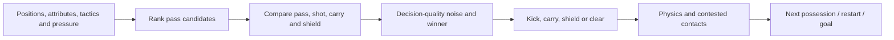

# Player behavior: from attributes to actions

On-pitch AI lives in [match_engine.cpp](../../src/model/match_engine.cpp),
with role profiles in [tactics.cpp](../../src/model/tactics.cpp). It combines
team assignments, geometric targets, utility scores and physical execution.
It is not a behavior tree or a learned policy. `PlayerAgent` is the contract
negotiation model; it does not control a footballer on the pitch.

Read [Match engine](match-engine.md) first for ownership and coordinate units.

## Persistent player versus match slot

[Player](../../src/model/player.h) stores identity, named attributes, natural
position, foot, height, hidden traits and `PlayerDynamics` (career condition,
morale, sharpness, injury history and minutes). Daily world systems change
those values between matches. `MatchPlayer` borrows that player and caches the
values used in the current match, plus position, velocity, intent, condition,
sprint reserve and cooldowns.

`loadAttributes()` reads nine named attributes: Pace, Shooting, Passing,
Dribbling, Defending, Goalkeeping, Physicality, Stamina and Vision. Raw values
are scaled from the career's 0–100 range; a missing named attribute falls back
to overall rating. `computeLevel()` partially shifts both lineups toward the
reference level, then `stretchAttribute()` applies the engine's contrast curve.
This controls how differences between teams translate into play. A separate
level-precision factor affects finishing. These values are not simply
`career attribute / 100` in every calculation.

| Input | Main uses in the match |
|-------|------------------------|
| Pace | Top speed, acceleration and pursuit/run selection |
| Physicality | Acceleration/braking, duels and aerial reach |
| Stamina attribute (`endurance`) | Relief from running/pressing energy drain |
| Live `stamina` | Current condition; influences speed and execution error |
| `sprintReserve` | Short-term capacity for repeated high-intensity runs |
| Vision | Decision noise, reading the offside line and choices |
| Passing | Pass execution, completion estimates and decision quality |
| Shooting | Shot precision and shot preference |
| Dribbling | Carry preference, close control and take-ons |
| Defending | Challenge reach/outcomes and defensive contests |
| Goalkeeping and height | Keeper positioning, reaction, reach and handling |
| Preferred foot | Cutting inside and response to weak-foot pressure |

Home advantage boosts selected cached attributes and also affects execution
and refereeing. Team talks, familiarity, tactical roles and score state modify
behavior elsewhere. A new JSON attribute has no automatic effect on AI:
define its model meaning, load it and add a deliberate consumer.

## Behavior between matches

[WorldSimulation](../../src/model/world_simulation.cpp) advances the career
side of the player model on daily, weekly and event boundaries:

| Entry point | What changes and why |
|-------------|----------------------|
| `processDaily()` | Condition recovers toward full freshness, sharpness decays without matches, injury days count down, and training creates workload/exposure. Fitness and match readiness are separate, so a rested player can still lack sharpness. |
| `processWeekly()` / `developPlayer()` | Training quality, minutes, professionalism, morale, age and the gap to potential shape growth. Growth is distributed into attributes, with physical improvement restricted by age. |
| `updateWeeklyMorale()` | Playing share and squad expectations feed satisfaction; compare actual use with the player's expected role rather than applying one morale change to everyone. |
| `onMatchPlayed()` | Match consequences return minutes, condition, injuries and results to the career systems after the engine finishes. |

Training plans and individual focus live in
[TrainingSystem](../../src/model/training.h); mentoring adjusts traits and
development support in [MentoringSystem](../../src/model/mentoring.h).
Conversations/promises live in [interactions](../../src/model/interactions.h),
while [PlayerAgent](../../src/model/player_agent.h) evaluates contract demands
and replies. Extend those systems for off-pitch decisions instead of adding
career mutations to a match tick. The separation keeps a replay or highlight
prediction from accidentally training a player or changing his contract.

## Team phase and coordinated assignments

`updateTeamPhases()` determines whether a side is in possession, final-third
attack, defensive block, a transition or a set piece. A pass in flight remains
part of its team's controlled phase. If every released ball counted as a
turnover, teams would repeatedly abandon support positions and chase the ball.

`refreshTacticalTargets()` plans from the current, unmoved positions:

1. Gather active players per side, read offside lines and effective sliders.
2. Choose the nearest pressure/loose-ball candidates using estimated arrival
   time, velocity, pressing eagerness and continuity. A pass's intended receiver
   has priority on his own side.
3. Choose a bounded number of committed runners. Natural position, pace,
   depth, width, role bias and stable epoch noise rank them. Limiting striker
   runners leaves a forward available to come short and midfielders to arrive.
4. Choose supporting players, late box arrivals, a far-post runner and overlaps
   when the situation allows; periodically assign marks.
5. Give each active player a target and `PlayerIntent`, then let the movement
   stage advance all bodies.

Continuity bonuses reduce oscillation: the nearest two players should not swap
jobs every time they move a few centimetres. The common planning stage also
prevents later players in vector order from reacting to earlier players who
have already moved.

## Shape, roles and duties

Three concepts have different responsibilities:

| Concept | Meaning |
|---------|---------|
| `PlayerRole` | The footballer's natural position; still used for runner priorities, positional choices and replacement fit |
| Formation slot | A job with an anchor in lineup coordinates; the match assigns occupants to it |
| `TacticalRole` + `RoleDuty` | Instructions for interpreting that slot, resolved into a numeric `RoleProfile` |

`Strategy::findSlot()` matches stored instructions by anchor, and
`resolveTactics()` checks role compatibility with the slot's `RoleFamily`.
Substitutes inherit the slot's tactical job. The keeper has a separate role
profile. Unsupported slot roles fall back to Standard.

The base target starts from `basePosition`, or from `possessionAnchor()` when
the side controls the ball. The latter adds the stored possession offset and
the role's advance/width offsets. Team width and ball-following shifts then
move the block. Defending compresses the lines around the threat and adjusts
depth with the ball and pressing setting.

| Slider | Mechanism to inspect |
|--------|----------------------|
| Pressing | Who closes down, engagement rate, block height and energy cost |
| Risk taking | Progress versus safety in pass utility and carry preference |
| Offensive bias | Forward passing value and attacking commitment |
| Width usage | Lateral spread of formation targets |
| Compactness | Ball-following shifts and defensive length/width compression |

`computeEffectiveSliders()` adds score/time response, underdog behavior and
fading shouts to the stored strategy. A displayed base slider therefore need
not equal the value currently driving the engine. Inspect
`getEffectiveSliders()` when debugging.

Profiles are biases over the common algorithm. For example, a Playmaker values
forward passes; an InsideForward tends inward and becomes keener to shoot;
a PressingForward competes harder for pressing assignments. Duties adjust
commitment on top of the role. The old `RoleWeights` grid API in `Strategy`
is retained, but the live engine does not call its attack/defense weight queries.

## Off-ball intentions and physical movement

The target branches cover the carrier, attacking teammates, defenders and
loose/pass-flight situations. Some useful intents are:

| Intent | Observable purpose |
|--------|--------------------|
| `OFFER_SUPPORT` | Supply a passing outlet without committing every player beyond the defence |
| `RUN_IN_BEHIND`, `ATTACK_BOX`, `OVERLAP` | Distinct attacking runs selected by the team planner |
| `PRESS_BALL`, `COVER_PRESS` | Close the carrier and support the challenge |
| `BLOCK_PASSING_LANE`, `MARK_OPPONENT` | Protect a route or follow an assigned opponent |
| `RECEIVE_PASS` | Meet the ball along its path or near a controllable landing point |
| `CLAIM_LOOSE_BALL`, `RECOVER_SHAPE` | Contest with selected players while the others recover structure |
| `GOALKEEP` | Use the keeper's own positioning state |

These are semantic labels attached to targets, not independent scripts that
teleport players. `integrateMovements()` blends a tactical target into the
movement target with a familiarity-dependent response. It applies acceleration,
braking, turning, fatigue and speed limits. Players slow to arrive and cannot
reverse their velocity instantly. `separatePlayers()` resolves body overlap
after movement. Its sorted nearby-pair pass avoids checking every distant pair.

The movement kernel gathers values into arrays so the compiler can process
multiple players efficiently. Preserve its relationship with scalar
`stepKinematics()` when changing acceleration or turning; controlled movement
uses the scalar path. Changing just one path makes human and AI bodies differ.

`accumulatePlayerLoad()` measures displacement at the tactical cadence and
updates report distance, live condition and sprint reserve together. Pressing
costs the whole defending side energy as well as the active presser. Restart
teleports are excluded. Fitness changes therefore follow work performed,
instead of being a fixed deduction for every player at the same minute.

## On-ball choice and execution

`resolvePossessionAndActions()` first updates the dribble touch and allows a
challenge. Only a player still in possession, within kick reach and eligible
to act reaches `decideAction()` (or the controlled-action path).

`choosePassTarget()` filters inactive players, distance, long keeper back-passes
and perceived offside. `evaluatePassOption()` then scores receiver space, lane
risk, distance, forward progress, pressure relief, running intent, role biases
and shot creation. It also chooses a tactical pass intent and leads the target
using the receiver's velocity/run. Neither evaluation consumes sequential RNG.

The completion estimate ranks the option; it is not a promise of success.
`passBall()` adds lateral error from technique, distance, pressure and fatigue,
sets ground/lofted flight and records release-time offside. Deflections,
interceptions and first touch determine completion later.

`decideAction()` compares these utilities:

* **Pass:** the best acceptable candidate's value.
* **Shot:** estimated xG, credible range, shooting skill, pressure, role,
  position and shout effects. Ineligible shots start at negative infinity.
* **Carry:** space ahead, dribbling and risk preference, reduced by pressure
  and time already spent holding the ball.
* **Shield:** available under pressure with no good pass. In the own defensive
  third, winning this comparison can become a clearance.

Vision/passing decision quality, familiarity and team effects scale bounded
random noise on close choices. Utilities are not probabilities and do not sum
to one. Score-state adjustments discourage speculative attempts when protecting
a lead. The winner calls the same execution functions that produce physical
ball flight; it also writes `ScenarioDecision` for inspection.

## Defending, keepers and external control

Dribbling exposes the ball between touches. The nearest eligible AI defender
decides whether to engage based on distance to the ball, exposure, pressing and
context. Engagement uses a rate converted to a step probability
(`1 - exp(-rate * dt)`), so changing step duration does not directly multiply
the number of tackle attempts. `attemptTackle()` resolves the challenge,
and foul/advantage/sanction paths may stop play or defer the restart.

Opposition instructions change mechanisms: tight marking follows a target,
Press reduces stand-off and raises engagement, ShowWeakFoot shades the defender
and increases execution difficulty under pressure, and DoubleUp commits a helper.
They target player IDs, not the opponent's formation index.

Keepers have `GoalkeeperState` values such as SET_POSITION, SWEEP, RUSH, CLAIM,
DIVE, HOLD and DISTRIBUTE. `goalkeeperTarget()` positions them relative to the
ball/goal; shot prediction plans reaction and a dive. Handling checks combine
ball height, reach and the keeper's actual body position. Horizontal and
vertical reach share a budget, so a keeper at full stretch overhead cannot also
claim a ball several metres sideways. `MatchRules::goalkeeperHandlingRadiusMetres()`
is the shared geometric rule; renderers visualize the resulting state.

External input replaces one outfield player's AI movement and on-ball choice.
It retains attribute errors, fatigue, ball contacts and football rules. Pass
assistance ranks receiver options within an aim cone; it does not guarantee
completion. Switching, buffered button presses and hand-back are handled in
the engine and recorded for replay. UI device sampling lives in
[MatchPlayController](../../src/gui/scenes/match_play_controller.h).

## Reproducing a suspicious decision

Start with a fixed seed and keep player storage plus `StatsConfig` alive.
Construct a fresh engine and a `MatchScenario` with known player IDs/positions
and an included carrier. `applyScenario()` immediately executes the carrier's
normal decision without advancing a physics step. Inspect
`getLastScenarioDecision()` (best and runner-up pass, utilities, reason),
`getLastPassDecision()` and `getDebugSnapshotJson()`.

This is a test hook, not a save-state deserializer: it does not restore every
timer or random-generator state, and an invalid scenario may have changed the
engine before returning false. Use a fresh engine for each independent case.
See [test_match_scenarios.cpp](../../test/test_match_scenarios.cpp) for complete
fixtures and [test_tactics.cpp](../../test/test_tactics.cpp) for behavioral role
comparisons. Assert an observable outcome or preference, then verify replay
and aggregate balance when changing the decision model.
