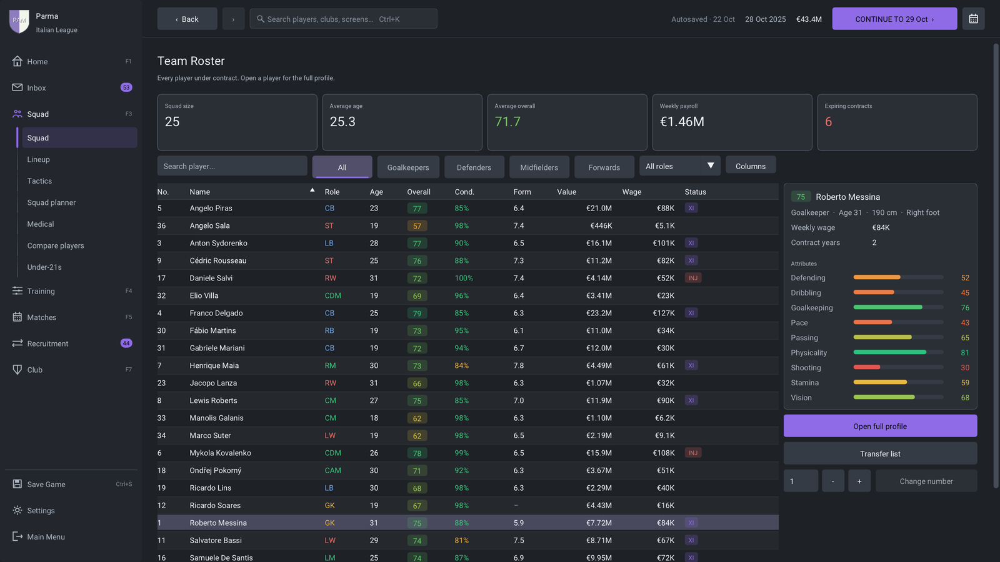
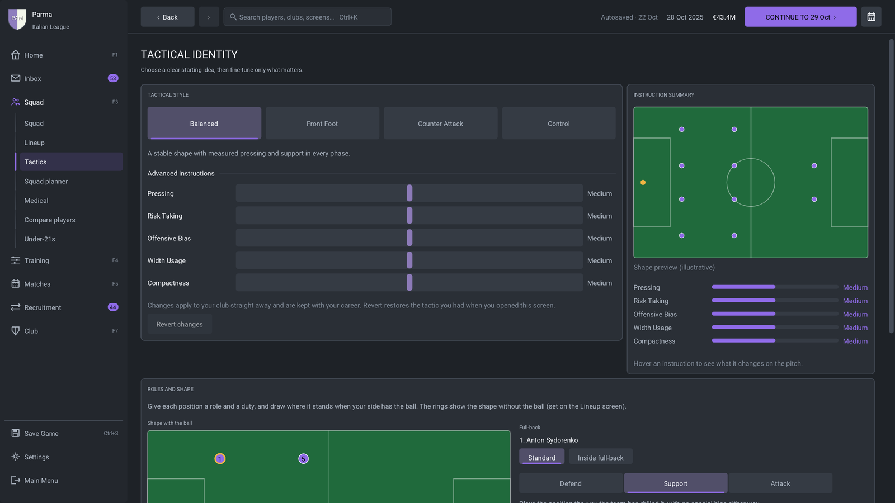
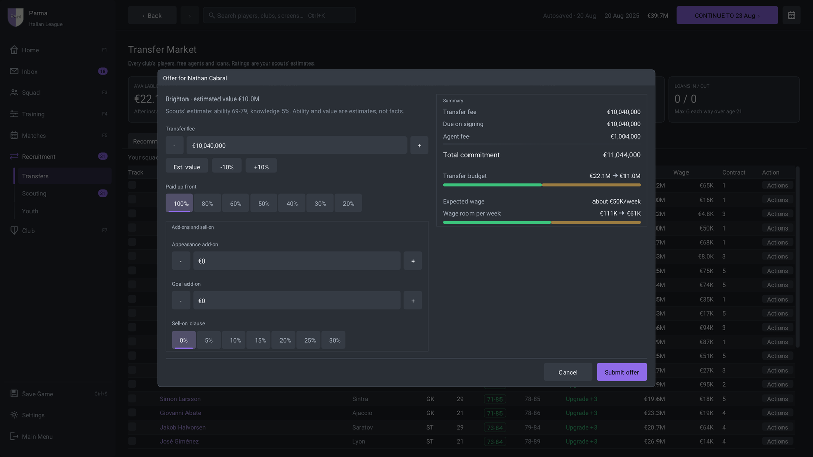
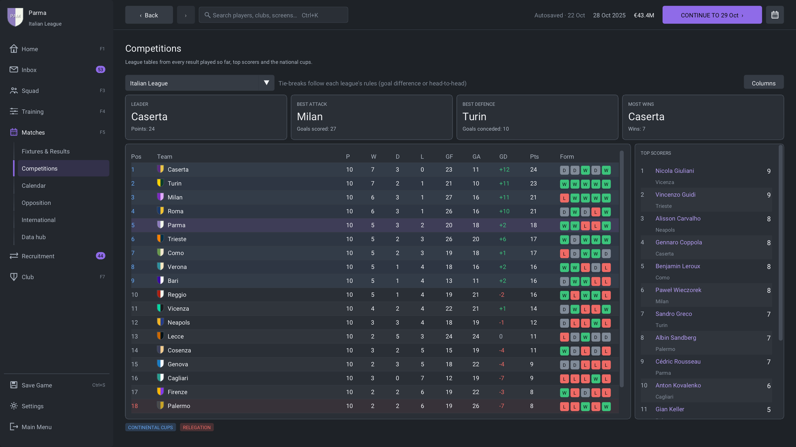
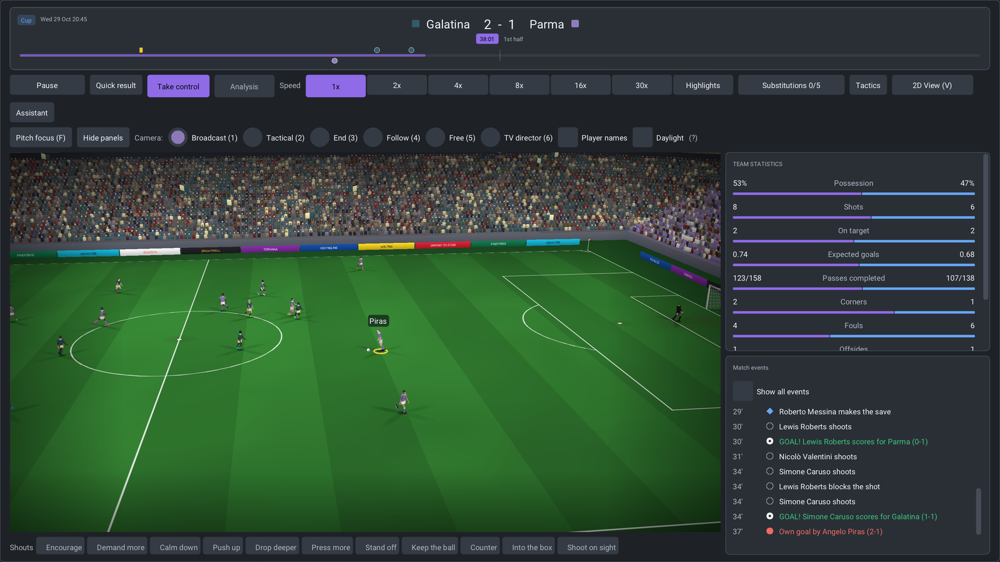
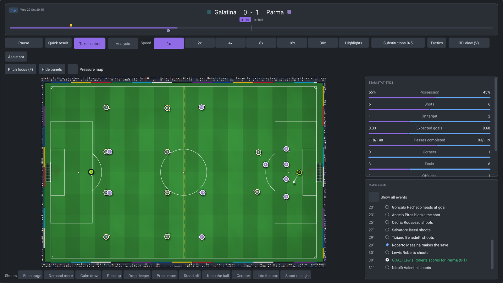
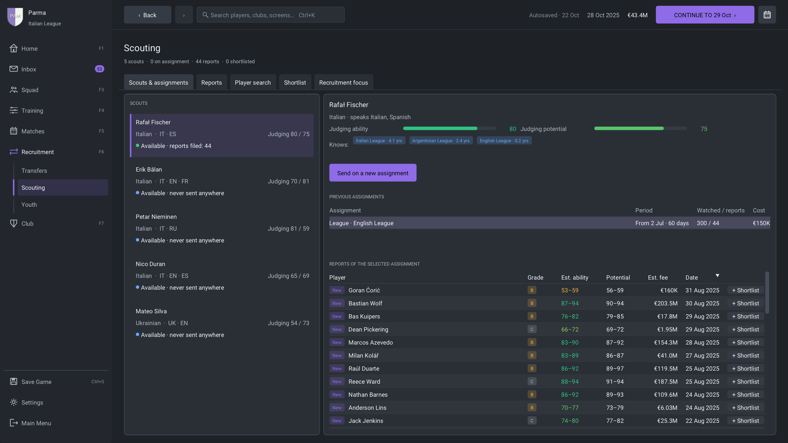
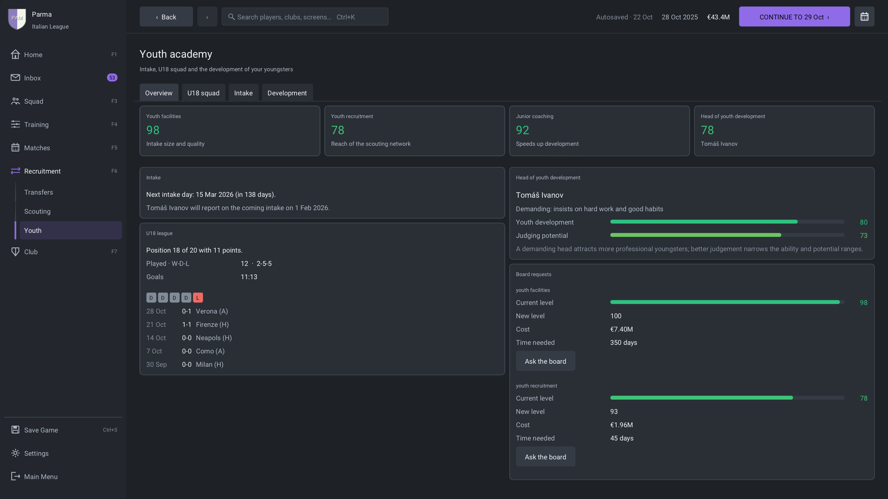

# Feature tour

**Management**

- One management shell with seven sidebar hubs, F1-F7 shortcuts and a
  command palette (Ctrl+K) that finds players, clubs, screens and pending
  tasks; browser-style Back and Forward (touchpad swipe, mouse side
  buttons, Alt+Left/Right).
- A Home dashboard with the next fixture and a *Next steps* card, and an
  inbox that separates decisions from information, lets you act inline and
  filters by player or club; decision moments such as a disputed fine or a
  fans' protest about ticket prices.
- A world news hub, cup and continental draw ceremonies, and a career
  timeline you can export as a journal.
- Continue advances the calendar on a background worker and can be stopped
  at the end of a day; holiday mode hands the club to your assistant until
  a date, a match or a decision.
- Delegation of lineup fixes, substitutions, training, renewals, scouting,
  friendlies and youth contracts to the assistant manager.
- A welcome tour, a first-week checklist, and a Help screen (F8) with the
  shortcuts and a football glossary.
- English and Italian with locale-aware money, six themes, colour-vision
  modes, text size and interface scaling for HiDPI displays, layouts that
  adapt from 1280x720 to 4K, and keyboard shortcuts you can rebind.

**Match day**

- A real-time engine with player movement and fatigue, ball flight with
  drag, bounce and roll, goalkeeping, dribbling, tackles, marking and
  pressing.
- The laws of the game: offside, fouls and advantage, yellow and red cards,
  free kicks, penalties, corners, throw-ins, goal kicks and added time.
- 2D and 3D views of the same match, speeds from 1x to 30x, a Highlights
  mode and a Quick result button; six 3D cameras including a TV director,
  with mouse orbit, pan and zoom, animated players, and a day-lit stadium
  for afternoon kick-offs.
- Play mode: take control of your team on the pitch with the keyboard or a
  gamepad, one footballer at a time, under the same rules, attributes and
  fatigue as a watched match.
- Player roles and duties for every position, and a separate shape with
  the ball that you drag into place on the tactics screen.
- A substitutions board, an in-match tactics panel and eleven touchline
  shouts; pre-match and half-time team talks that the players carry onto
  the pitch.
- Opposition reports with individual instructions the engine plays out:
  tight marking, closing down, showing a player onto his weaker foot or
  doubling up on him.
- Cup ties played to a winner through extra time and a live penalty
  shootout; match reports with expected goals, shot maps, touch maps and
  pass networks, and half-time and full-time analysis.
- Procedural match sound: crowd, whistles and ball contacts.

**Competitions**

- 22 leagues in eleven countries, each with a top and a second division,
  promotion and relegation, and a domestic cup.
- Continental club competitions with Swiss-style league phases, two-legged
  knockout rounds, prize money and coefficients.
- National teams with qualifiers, finals tournaments, friendlies and
  call-ups of your players.
- League tables with clinch marks, archived seasons, a data hub with
  league leaders, and an end-of-season review with the board's verdict.

**The club and the world**

- Finances with TV, merit, gate and commercial income, wage and staff
  budgets, a ledger, ticket pricing, parachute payments and transfer
  budgets tied to real cash.
- Board objectives for the league, the cup, the finances and young
  players; confidence, warnings, dismissal, transfer embargoes and facility
  projects. Supporter mood that the board listens to.
- Injuries and a medical centre with load charts, rest and minute limits;
  fatigue, sharpness, morale and form; player development driven by age,
  training, minutes and staff.
- Squad status, captains, set-piece takers and squad numbers, a squad
  planner and player comparison; player conversations, promises and
  dressing-room stories.
- Coaching, medical, scouting and youth staff; weekly training plans and
  mentoring groups.

**Transfers, scouting and youth**

- Transfer search with affordability filters and need-based
  recommendations, and transfer windows that follow each country's
  calendar.
- Negotiations with counter-offers, instalments, add-ons and sell-on
  clauses, loans in both directions, pre-contracts, free agents and release
  clauses; agents who talk back; bids for your own players that you can
  negotiate too.
- Scouts with nationalities, languages and regional experience. Players
  outside your club are shown as estimates whose ranges narrow as your
  knowledge grows.
- A yearly youth intake with a February preview and a March intake, an
  under-18 league, scholarships and first professional contracts; an
  under-21 squad for every club with its own league.

**Career**

- A manager profile with reputation and coaching licence, a job centre,
  interviews, offers from other clubs, resignation and sacking. You can
  start unemployed.
- National-team jobs, alone or next to your club job: pick the squad for
  each international window and qualify for the finals.
- Monthly and season awards, player honours, and club and league records.
- Three save slots, autosave and restorable backups. The game plays on an
  in-memory copy and only replaces a save with a verified snapshot; a save
  that does not load can be restored from its newest good backup, and a
  crash leaves a report on your computer (nothing is sent anywhere).

The [changelog](../../CHANGELOG.md) has the complete list.

## Screenshots

| | |
|---|---|
|  |  |
| **Squad**: the first team with a player's details beside the list. | **Tactics**: styles, instructions, roles and the shape with the ball. |
|  |  |
| **Transfers**: an offer for another club's player. | **Competitions**: league tables, cups and continental football. |
|  |  |
| **Match day in 3D**: the broadcast camera. | **Match day in 2D**: the tactical view of the same match. |
|  |  |
| **Scouting**: scouts, assignments and reports. | **Youth academy**: facilities, the under-18 league and the next intake. |

